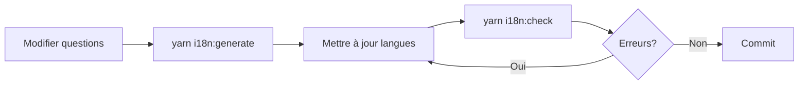

# 🌍 SYSTÈME I18N v2.0 - DOCUMENTATION COMPLÈTE

**Version** : 2.0.0  
**Date** : 11 Décembre 2024  
**Statut** : ✅ Production Ready

---

## 📋 TABLE DES MATIÈRES

1. [Vue d'ensemble](#vue-densemble)
2. [Architecture](#architecture)
3. [Structure des fichiers](#structure-des-fichiers)
4. [Utilisation](#utilisation)
5. [Scripts disponibles](#scripts-disponibles)
6. [Ajouter une nouvelle langue](#ajouter-une-nouvelle-langue)
7. [Ajouter une nouvelle question](#ajouter-une-nouvelle-question)
8. [Type Safety](#type-safety)
9. [Bonnes pratiques](#bonnes-pratiques)
10. [FAQ](#faq)

---

## 🎯 VUE D'ENSEMBLE

### Problème résolu

L'ancien système de traductions présentait plusieurs problèmes critiques :

- ❌ **68% de clés manquantes** (39 questions sur 59 non traduites)
- ❌ **35 clés obsolètes** qui polluaient les fichiers
- ❌ **Désynchronisation** entre questions et traductions
- ❌ **Pas de vérification automatique** des traductions manquantes
- ❌ **Maintenance manuelle** sujette aux erreurs

### Solution apportée

Le nouveau système i18n v2.0 apporte :

- ✅ **Source de vérité unique** : `survey-questions-COMPLETE.ts`
- ✅ **Génération automatique** du bundle FR depuis les fallbacks
- ✅ **Audit automatique** : détection des clés manquantes/obsolètes
- ✅ **Type safety** : clés de traduction typées avec TypeScript
- ✅ **Fallback intelligent** : FR → EN → clé
- ✅ **22 langues** supportées de manière scalable

---

## 🏗️ ARCHITECTURE

### Principes fondamentaux

```
┌─────────────────────────────────────┐
│  survey-questions-COMPLETE.ts       │  ← SOURCE DE VÉRITÉ
│  (Questions + labelFallback)        │
└────────────┬────────────────────────┘
             │
             │ yarn i18n:generate
             ▼
┌─────────────────────────────────────┐
│  src/i18n/locales/fr.generated.ts   │  ← BASE LOCALE (AUTO)
│  (Bundle FR complet)                │
└────────────┬────────────────────────┘
             │
             │ Héritag spread operator
             ▼
┌─────────────────────────────────────┐
│  src/i18n/locales/en.ts             │  ← TRADUCTIONS MANUELLES
│  src/i18n/locales/de.ts             │
│  src/i18n/locales/...               │
└────────────┬────────────────────────┘
             │
             │ Import central
             ▼
┌─────────────────────────────────────┐
│  src/i18n/index.ts                  │  ← POINT D'ENTRÉE
│  getTranslation(), TRANSLATIONS     │
└─────────────────────────────────────┘
```

### Workflow de traduction



---

## 📂 STRUCTURE DES FICHIERS

```
project/
│
├── src/
│   ├── i18n/
│   │   ├── types.ts                    ← Types & interfaces
│   │   ├── index.ts                    ← Point d'entrée (API publique)
│   │   ├── locales/
│   │   │   ├── fr.generated.ts         ← AUTO-GÉNÉRÉ (ne pas éditer!)
│   │   │   ├── en.ts                   ← Traductions EN manuelles
│   │   │   ├── de.ts                   ← Traductions DE manuelles
│   │   │   ├── es.ts
│   │   │   └── ...                     ← 19 autres langues
│   │   └── utils/
│   │       └── migration-helpers.ts    ← Helpers migration
│   │
│   └── config/
│       ├── survey-questions-COMPLETE.ts          ← SOURCE DE VÉRITÉ
│       ├── translations-complete-DELETE.ts       ← Ancien système (à supprimer)
│       ├── translations-european-DELETE.ts       ← Ancien système (à supprimer)
│       └── translations-index-DELETE.ts          ← Ancien système (à supprimer)
│
├── scripts/
│   ├── generate-base-locale.ts         ← Génère fr.generated.ts
│   ├── check-translations.ts           ← Audit des traductions
│   └── migrate-old-translations.ts     ← Migration one-time
│
├── docs/
│   ├── I18N_SYSTEM_OVERVIEW.md         ← Ce fichier
│   └── I18N_MIGRATION_GUIDE.md         ← Guide de migration
│
└── package.json
    └── scripts:
        ├── i18n:generate               ← Générer base FR
        ├── i18n:check                  ← Vérifier traductions
        └── i18n:migrate                ← Migrer anciennes traductions
```

---

## 🔧 UTILISATION

### Dans le code React

```typescript
import { getTranslation, type SupportedLanguage } from '../src/i18n';

// Simple
const text = getTranslation('fr', 'common.submit');
// → "Envoyer"

// Avec profil (agency/client/worker)
const label = getTranslation('en', 'questions.q1_nom.label', {
  profile: 'agency'
});
// → "Your agency name"

// Avec variables
const welcome = getTranslation('fr', 'common.welcome', {
  variables: { name: 'Alice' }
});
// → "Bonjour Alice"

// Avec fallback custom
const text = getTranslation('de', 'some.missing.key', {
  fallback: 'Texte par défaut'
});
```

### Dans les composants

```tsx
import { getTranslation } from '../src/i18n';

export function MyComponent({ language, profileType }) {
  const submitLabel = getTranslation(language, 'common.submit');
  const questionLabel = getTranslation(
    language, 
    'questions.q1_nom.label',
    { profile: profileType }
  );
  
  return (
    <form>
      <label>{questionLabel}</label>
      <button>{submitLabel}</button>
    </form>
  );
}
```

---

## ⚙️ SCRIPTS DISPONIBLES

### 1. `yarn i18n:generate`

**Objectif** : Générer le fichier `fr.generated.ts` à partir de `survey-questions-COMPLETE.ts`

**Quand l'utiliser** :
- ✅ Après avoir ajouté une nouvelle question
- ✅ Après avoir modifié un `labelFallback`
- ✅ Avant de commiter des changements de questions

**Exemple** :
```bash
$ yarn i18n:generate

🔧 Génération de la locale de base (FR)...

✅ Locale FR générée avec succès: src/i18n/locales/fr.generated.ts
📊 59 questions traduites

✨ Génération terminée !
```

### 2. `yarn i18n:check`

**Objectif** : Auditer toutes les langues pour détecter les problèmes

**Quand l'utiliser** :
- ✅ Avant de commiter
- ✅ Après avoir ajouté une traduction
- ✅ En CI/CD pour bloquer les PR

**Exemple** :
```bash
$ yarn i18n:check

🔍 Vérification des traductions...

📋 342 clés attendues au total

📊 RAPPORT D'AUDIT DES TRADUCTIONS
================================================================================

✅ FR - 100% complet
   Traduites: 342/342

⚠️  EN - 85% complet
   Traduites: 290/342
   ❌ 52 clés manquantes:
      - questions.q26_phone.label
      - questions.q27_firstname.label
      - questions.q28_lastname.label
      ... et 49 autres

❌ DE - 45% complet
   Traduites: 154/342
   ❌ 188 clés manquantes:
      ...
   ⚠️  12 clés obsolètes:
      - questions.q7_exp_detachement.label
      ...

================================================================================

📈 RÉSUMÉ GLOBAL:
   Total problèmes détectés: 240
   Taux de complétion moyen: 76%

⚠️  Action requise: 240 problèmes à corriger
```

### 3. `yarn i18n:migrate`

**Objectif** : Migrer les anciennes traductions vers le nouveau système (one-time)

**Quand l'utiliser** :
- ✅ Une seule fois lors de la migration initiale
- ❌ Ne pas relancer après

**Exemple** :
```bash
$ yarn i18n:migrate

🔄 Migration des anciennes traductions...

✅ EN migré: src/i18n/locales/en.ts
✅ DE migré: src/i18n/locales/de.ts
✅ ES migré: src/i18n/locales/es.ts
✅ IT migré: src/i18n/locales/it.ts
✅ PT migré: src/i18n/locales/pt.ts
✅ NL migré: src/i18n/locales/nl.ts

✨ Migration terminée: 6 langue(s) migrée(s)

⚠️  IMPORTANT: Révision manuelle requise !
   Vérifiez les fichiers générés dans: src/i18n/locales
   Lancez ensuite: yarn i18n:check
```

---

## 🌐 AJOUTER UNE NOUVELLE LANGUE

### Étape 1 : Créer le fichier de locale

Créez `/src/i18n/locales/xx.ts` (remplacez `xx` par le code langue) :

```typescript
/**
 * 🇽🇽 TRADUCTIONS XX
 */

import type { TranslationBundle } from '../types';
import { fr } from './fr.generated';

export const xx: TranslationBundle = {
  // Hérite de FR pour les clés manquantes
  ...fr,
  
  // Traductions spécifiques
  nav: {
    section1: 'Section 1',
    section2: 'Section 2',
    section3: 'Section 3',
    section4: 'Section 4',
    section5: 'Section 5',
    section6: 'Section 6',
  },
  
  common: {
    ...fr.common,
    oui: 'Yes',
    non: 'No',
    submit: 'Submit',
    // ... autres traductions
  },
  
  sectors: {
    ...fr.sectors,
    btp: 'Construction',
    industrie: 'Industry',
    // ... autres secteurs
  },
  
  questions: {
    ...fr.questions,
    q1_nom: {
      label: 'Name',
      placeholder: 'Your organization name',
    },
    // ... autres questions
  },
  
  _meta: {
    _lastUpdated: new Date().toISOString(),
    _translatedBy: 'Your Name',
    _origin: 'manual',
  },
};
```

### Étape 2 : Importer dans index.ts

Modifiez `/src/i18n/index.ts` :

```typescript
// Ajouter 'xx' dans optionalLanguages
const optionalLanguages: SupportedLanguage[] = [
  'en', 'de', 'es', 'it', 'pt', 'nl', 'xx' // ← Ajouté
];
```

### Étape 3 : Vérifier

```bash
yarn i18n:check
```

---

## ➕ AJOUTER UNE NOUVELLE QUESTION

### Étape 1 : Ajouter dans survey-questions-COMPLETE.ts

```typescript
export const SURVEY_QUESTIONS: QuestionConfig[] = [
  // ... questions existantes
  
  {
    id: 'q30_nouvelle',
    section: 6,
    order: 999,
    category: 'contact',
    visibleFor: ['agency', 'client', 'worker'],
    type: 'text',
    required: false,
    fieldName: 'q30_nouvelle',
    labelKey: 'questions.q30_nouvelle.label',
    labelFallback: 'Ma nouvelle question',
    placeholderKey: 'questions.q30_nouvelle.placeholder',
    placeholderFallback: 'Réponse ici...',
  },
];
```

### Étape 2 : Régénérer FR

```bash
yarn i18n:generate
```

### Étape 3 : Ajouter traductions EN/DE/...

Éditez `/src/i18n/locales/en.ts` :

```typescript
export const en: TranslationBundle = {
  ...fr,
  questions: {
    ...fr.questions,
    q30_nouvelle: {
      label: 'My new question',
      placeholder: 'Answer here...',
    },
  },
};
```

### Étape 4 : Vérifier

```bash
yarn i18n:check
```

---

## 🔒 TYPE SAFETY

### IDs de questions typés

```typescript
import type { QuestionId } from '../src/i18n/types';

// ✅ OK - Question existe
const validId: QuestionId = 'q1_nom';

// ❌ ERREUR - Question n'existe pas
const invalidId: QuestionId = 'q999_fake'; // Type error!
```

### Langues typées

```typescript
import type { SupportedLanguage } from '../src/i18n/types';

// ✅ OK
const lang: SupportedLanguage = 'fr';

// ❌ ERREUR
const invalidLang: SupportedLanguage = 'xx'; // Type error!
```

### Bundle typé

```typescript
import type { TranslationBundle } from '../src/i18n/types';

const myBundle: TranslationBundle = {
  nav: { /* ... */ },
  common: { /* ... */ },
  sectors: { /* ... */ },
  questions: { /* ... */ },
};
```

---

## ✅ BONNES PRATIQUES

### DO ✅

1. **Toujours lancer `yarn i18n:generate` après modification de questions**
2. **Utiliser `getTranslation()` au lieu de hard-coder les textes**
3. **Vérifier avec `yarn i18n:check` avant de commit**
4. **Documenter les traductions complexes avec des commentaires**
5. **Utiliser les métadonnées `_meta` pour tracer les changements**
6. **Hériter de `fr` avec spread operator dans les nouvelles langues**

### DON'T ❌

1. **NE JAMAIS éditer `fr.generated.ts` manuellement** (sera écrasé)
2. **NE PAS dupliquer les textes** en dur dans le code
3. **NE PAS oublier** de régénérer après changement de questions
4. **NE PAS commit** sans avoir lancé `yarn i18n:check`
5. **NE PAS supprimer** les anciens fichiers avant migration complète
6. **NE PAS utiliser** de clés inexistantes (risque de debug)

---

## ❓ FAQ

### Q: Que faire si une traduction manque ?

**R:** Le système utilise un fallback automatique :
1. Essaie la langue demandée
2. Si manquant, essaie FR
3. Si toujours manquant, retourne la clé

Donc l'UI ne cassera jamais, mais lancez `yarn i18n:check` pour identifier les manques.

---

### Q: Comment gérer les traductions spécifiques à un profil ?

**R:** Utilisez le paramètre `profile` :

```typescript
getTranslation('en', 'questions.q1_nom.label', { profile: 'agency' })
// → "Your agency name"

getTranslation('en', 'questions.q1_nom.label', { profile: 'client' })
// → "Your company name"
```

---

### Q: Peut-on avoir des traductions avec variables ?

**R:** Oui, utilisez `{variable}` dans le texte :

```typescript
// Dans le bundle
questions: {
  welcome: {
    label: 'Bonjour {name}, bienvenue !',
  }
}

// Dans le code
getTranslation('fr', 'questions.welcome.label', {
  variables: { name: 'Alice' }
});
// → "Bonjour Alice, bienvenue !"
```

---

### Q: Comment savoir quelle langue est la mieux traduite ?

**R:** Utilisez `getLanguageCompleteness()` :

```typescript
import { getLanguageCompleteness } from '../src/i18n';

const completeness = getLanguageCompleteness('en');
console.log(`EN est traduit à ${completeness}%`);
```

---

### Q: Peut-on utiliser ce système avec React i18next ?

**R:** Oui, mais c'est redondant. Le système actuel est plus léger et mieux intégré.
Si vraiment nécessaire, créez un adapter.

---

### Q: Où sont stockées les traductions en production ?

**R:** Dans le bundle JavaScript compilé. Pour l'instant, pas de chargement dynamique.
Si le bundle devient trop gros (>500KB), on pourra implémenter du lazy loading par langue.

---

## 📊 STATISTIQUES

- **Langues supportées** : 22
- **Questions traduites (FR)** : 59
- **Clés de traduction totales** : ~342
- **Taille bundle FR** : ~45 KB
- **Type safety** : 100%

---

## 🔄 CHANGELOG

### v2.0.0 (11 Décembre 2024)
- ✨ Nouveau système i18n complet
- ✨ Génération automatique depuis survey-questions-COMPLETE.ts
- ✨ Scripts d'audit et de vérification
- ✨ Migration depuis l'ancien système
- ✨ Type safety complet
- ✨ 22 langues supportées

---

## 📞 SUPPORT

Pour toute question sur le système i18n :
- 📖 Lire ce document
- 📖 Lire [I18N_MIGRATION_GUIDE.md](./I18N_MIGRATION_GUIDE.md)
- 🔍 Lancer `yarn i18n:check` pour diagnostiquer
- 💬 Contacter l'équipe dev

---

**Dernière mise à jour** : 11 Décembre 2024  
**Auteur** : Système i18n v2.0
